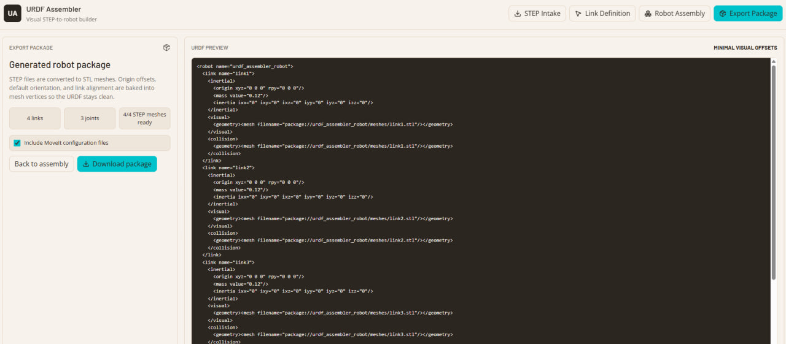

# URDF Assembler

URDF Assembler is a browser-based visual STEP-to-URDF robot builder for turning CAD parts into a robot package without hand-editing XML.

It was made for the moment where you already have STEP files, but you do not want to spend hours wiring together link names, joint origins, joint axes, mesh offsets, and export files by hand. The app keeps that workflow visual and local:

1. Upload STEP files.
2. Define link connection points.
3. Assemble the robot and inspect motion.
4. Export a clean robot package.

## Why this exists

Robotics CAD workflows usually break down into a lot of repetitive glue work:

- figuring out which STEP file is which robot link
- choosing the base link
- labeling where links connect
- estimating mass, center of mass, and inertia
- converting geometry into simulator-friendly meshes
- exporting package files for downstream tools

URDF Assembler is meant to remove that friction. The goal is to make robot kinematics feel closer to a visual builder than a text editor, while still producing the files that simulators and downstream tools expect.

## What it is for

This project is useful when you need to:

- convert a set of STEP files into a robot structure
- label connection points visually instead of editing URDF by hand
- inspect robot assembly, joint motion, and workspace behavior in the browser
- generate package-ready exports with meshes, inertial data, and configuration files
- keep the whole workflow local and browser-based

## Demo

The repository includes a short demo animation at [`src/assets/demo.gif`](src/assets/demo.gif).

<p align="center">
  
</p>

If your GitHub viewer does not render the image, open the file directly from the repository path above.

## Export Preview

The export flow is shown here with the generated package view and export controls.

<p align="center">
  
</p>

## Workflow

The intended flow is:

`Upload STEP -> Define Links -> Assemble Robot -> Export Package`

In practice, that means:

- STEP files become individual links
- connection points are labeled visually on each link
- the assembly view shows the full robot chain
- exports include clean robot assets instead of raw CAD clutter

## Stack

- React
- TypeScript
- React Three Fiber
- Three.js
- TailwindCSS
- Zustand
- OpenCascade WebAssembly
- `occt-import-js`

## Run locally

```bash
npm install
npm run dev
```

Open `http://127.0.0.1:5173`.

## Build

```bash
npm run build
```

## Notes

- The app runs fully in the browser.
- STEP parsing uses OpenCascade through WebAssembly.
- Meshes, link properties, and exports are generated locally from the uploaded files.
- The export pipeline is designed to keep URDF output clean while baking the required geometry adjustments into the generated meshes.

## TODO

- fix inertia parameters to accurately get correct results
